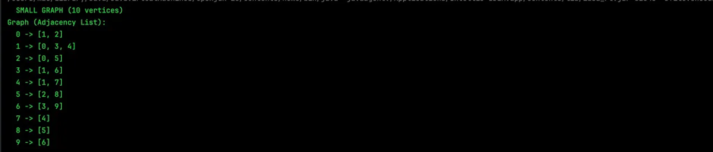
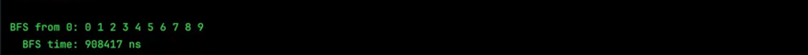
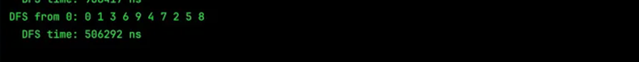
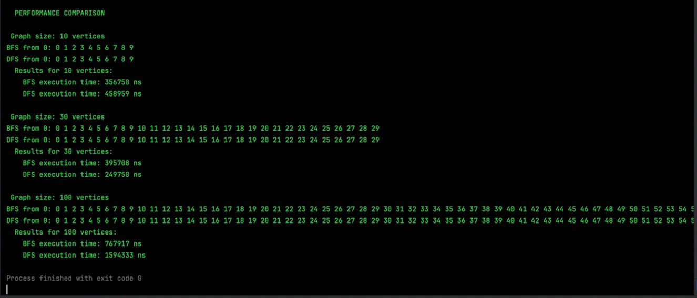
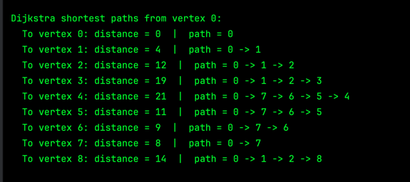

# Assignment 4: Graph Traversal and Representation System

**Student:** Anuarbek Nurkadyr  
**Group:** IT-2502  
**Course:** Algorithms and Data Structures  
**University:** Astana IT University


## A. Project Overview

This project implements a graph data structure from scratch in Java and applies two classic traversal algorithms — BFS and DFS — to study how they behave across different graph sizes.

A **vertex** (or node) is a fundamental unit of a graph — a single point identified by a unique integer id. In a real-world analogy, think of vertices as cities on a map.

An **edge** is a connection between two vertices. It defines which vertices are neighbors of each other. In this project, edges are undirected, meaning if vertex A connects to vertex B, then B also connects to A — like a two-way road.

The graph is stored using an **adjacency list**: each vertex maps to a list of its neighbors. This representation is memory-efficient and works well for sparse graphs, since it only stores existing connections rather than reserving space for all possible pairs.

**BFS (Breadth-First Search)** explores a graph layer by layer. Starting from a source vertex, it visits all immediate neighbors first, then their neighbors, and so on — spreading outward like ripples in water.

**DFS (Depth-First Search)** takes the opposite approach. It picks one path and follows it as deep as possible before backtracking and trying another direction. It is recursive by nature and explores branches completely before moving on.


## B. Class Descriptions

### `Vertex.java`
Represents a single node in the graph. Contains one private field — an integer `id` — along with a constructor, a getter, and a `toString()` method for readable output. Kept intentionally simple, since a vertex only needs to be uniquely identifiable within the graph.

### `Edge.java`
Represents a directed connection between two vertices. Stores a `source` vertex (where the edge begins), a `destination` vertex (where it ends), and a `weight` field representing the cost of traversing this edge. Provides constructors, getters for all three fields, and a `toString()` that prints the edge as `from -> to (weight: w)`.

> **Bonus update:** A `weight` field and `getWeight()` getter were added to support weighted graphs for Dijkstra's algorithm.

### `Graph.java`
The core data structure of the project. Uses a `HashMap<Integer, List<Integer>>` as its **adjacency list** — each vertex id maps to a list of neighboring vertex ids. For weighted graph support, a second map `HashMap<Integer, List<int[]>>` stores edges as `[neighborId, weight]` pairs.

Key methods:
- `addVertex(Vertex v)` — adds a vertex to the graph
- `addEdge(int from, int to)` — creates an undirected unweighted edge (used by BFS/DFS)
- `addWeightedEdge(int from, int to, int weight)` — creates an undirected weighted edge (used by Dijkstra)
- `printGraph()` — displays the full unweighted adjacency list
- `printWeightedGraph()` — displays the weighted adjacency list with edge weights
- `bfs(int start)` — executes Breadth-First Search from the given starting vertex
- `dfs(int start)` — executes Depth-First Search from the given starting vertex
- `dijkstra(int start)` — executes Dijkstra's algorithm and prints shortest distances and paths

**Adjacency List Representation:**  
Rather than a 2D matrix (which would require V² space), the adjacency list stores only actual edges. For example, if vertex 0 connects to vertices 1 and 2, the map stores `{0: [1, 2]}`. This makes it both memory-efficient and fast to iterate over neighbors.

### `Experiment.java`
Responsible for performance testing. Constructs graphs of sizes 10, 30, and 100 vertices, runs BFS and DFS on each, and measures execution time using `System.nanoTime()`. Prints a comparison of results for each graph size.

### `Main.java`
The program entry point. Creates a 10-vertex demo graph, prints its adjacency list, runs both traversals to show their order, then calls `Experiment` to run the full performance comparison across all three graph sizes. Also contains the Dijkstra bonus demo section.


## C. Algorithm Descriptions

### BFS — Breadth-First Search

**Step-by-step explanation:**
1. Start at the source vertex. Add it to a `Queue` and mark it as visited.
2. Remove the front vertex from the queue and process it (print its id).
3. For each of its neighbors that has not yet been visited — mark it as visited and add it to the queue.
4. Repeat steps 2–3 until the queue is empty.

**Time Complexity:** O(V + E) — each vertex is dequeued exactly once, and each edge is examined exactly once.

**Use cases:**
- Finding the **shortest path** in an unweighted graph (BFS guarantees the fewest edges)
- Level-order traversal of a tree
- Network broadcasting — finding all nodes reachable within k steps
- Web crawlers that explore links layer by layer


### DFS — Depth-First Search

**Step-by-step explanation:**
1. Mark the current vertex as visited and process it (print its id).
2. For each unvisited neighbor, recursively call DFS on it.
3. When all neighbors of the current vertex have been visited, backtrack to the previous call.

**Time Complexity:** O(V + E) — every vertex is visited once, and every edge is checked once.

**Use cases:**
- Detecting cycles in a graph
- Topological sorting of dependency graphs
- Solving mazes and path-finding puzzles
- Finding all connected components in a graph


## D. Experimental Results

All tests used graphs built with the same structure: each vertex `i` connects to vertex `i+1` and `i+2`, producing consistent edge density across sizes. Execution time was measured with `System.nanoTime()`.

### Timing Comparison Table

| Graph Size    | BFS Time (ns) | DFS Time (ns) |
|---------------|---------------|---------------|
| 10 vertices   | 356,750       | 458,959       |
| 30 vertices   | 395,708       | 249,750       |
| 100 vertices  | 767,917       | 1,594,333     |


### Observations and Patterns

At 10 vertices, BFS was faster than DFS — likely because the recursive call overhead in DFS adds up even for a small graph. At 30 vertices, DFS became faster, probably due to the specific structure of that graph favoring a deep path. At 100 vertices, BFS was noticeably faster: DFS time was roughly 3.5× its time at 10 vertices, while BFS only doubled. This shows that recursive DFS accumulates overhead more noticeably as the graph grows deeper.


### Analysis Questions

**1. How does graph size affect BFS and DFS performance?**  
As the graph grows larger, the execution time of both algorithms increases. This is expected — both BFS and DFS must visit every vertex and every edge at least once before they finish. So their running time grows in direct proportion to the graph's size, which gives a time complexity of O(V + E). A graph with twice as many vertices and edges will roughly take twice as long to traverse.

**2. Which traversal was faster in the experiments?**  
It varied by graph size. At 10 vertices, BFS was faster. At 30 vertices, DFS edged ahead. At 100 vertices, BFS was clearly faster. Overall, BFS performed more consistently across sizes. DFS tended to slow down more at larger scales due to the overhead from recursive function calls. For very large graphs, that recursion cost becomes a real factor.

**3. Do results match the expected complexity O(V + E)?**  
Yes, the pattern is consistent with linear growth. From 10 to 100 vertices — a 10× increase — BFS time roughly doubled while DFS time increased by about 3.5×. Both are within the range of linear scaling, considering that edge count also grows with the graph. The results confirm O(V + E) behavior, with DFS showing slightly more variance due to recursion overhead.

**4. How does graph structure affect traversal order?**  
The structure of the graph directly determines how each algorithm explores it. BFS always visits all immediate neighbors of the current vertex before moving further, so it produces a level-by-level order. DFS dives into one branch completely before backtracking, so the order depends heavily on which neighbor is listed first in the adjacency list. The same graph traversed by BFS and DFS produces different sequences — BFS gives a breadth-first order, DFS gives a depth-first order. Changing which neighbor is stored first in the list would change the DFS path but not the BFS level ordering.

**5. When is BFS preferred over DFS?**  
BFS is the right choice when you need the **shortest path** in an unweighted graph. Because it explores level by level, the first time BFS reaches any vertex, it always arrives via the fewest possible edges — which is exactly the shortest path. BFS is also used for level-order tree traversal, network broadcasting, and any problem where closeness to the source matters more than exploring deep paths.

**6. What are the limitations of DFS?**  
The main risk of DFS is **stack overflow** on very large or deeply nested graphs. Since DFS is implemented recursively, each call adds a frame to the call stack — and Java's call stack has a fixed limit. If the graph is deep enough, this limit is exceeded and the program crashes. Additionally, DFS does **not guarantee the shortest path** — the route it finds first might be much longer than the optimal one. Finally, the traversal order of DFS depends on the order neighbors are stored, making its behavior less predictable and harder to reason about across different graph representations.


## E. Screenshots

### Graph Structure Output


### BFS Traversal Output


### DFS Traversal Output


### Performance Results



## F. Reflection

Before this assignment, I had a theoretical understanding of graphs from lectures, but building one from scratch in code changed how I think about them. Implementing the adjacency list made it clear why this representation is preferred for sparse graphs — you only store connections that actually exist, which is both faster to iterate and cheaper in memory. Seeing the `HashMap<Integer, List<Integer>>` structure in action made the abstraction concrete.

The most valuable thing I took away from writing BFS and DFS is how one small missing piece — the visited set — can break everything. The first time I ran DFS without tracking visited nodes, the algorithm kept looping through the same vertices indefinitely. Adding the visited check fixed it immediately, and I finally understood its purpose intuitively rather than just knowing it as a rule. I also found it genuinely interesting that BFS and DFS visit the exact same nodes but produce entirely different orderings — a reminder that in graph problems, *how* you traverse often matters as much as *what* you traverse.


---

## G. Bonus Task — Dijkstra's Shortest Path Algorithm

### Overview

Dijkstra's algorithm finds the **shortest path from one starting vertex to all other vertices** in a weighted graph. Unlike BFS (which counts hops), Dijkstra considers the actual cost of each edge and always finds the path with the minimum total weight.

### What was changed

| File | Change |
|------|--------|
| `Edge.java` | Added `weight` field, updated constructor and `toString()` |
| `Graph.java` | Added `weightedAdjList`, `addWeightedEdge()`, `printWeightedGraph()`, and `dijkstra()` methods |
| `Main.java` | Added a Dijkstra demo section with a 9-vertex weighted graph |

### How Dijkstra's Algorithm Works

The algorithm maintains two arrays:

- `dist[]` — the shortest known distance from the start to each vertex (initially infinity, except the start which is 0)
- `visited[]` — whether a vertex has been finalized (its shortest path confirmed)

**Step-by-step:**

1. Set `dist[start] = 0`, all others to infinity.
2. Repeat until all vertices are visited:
    - Pick the **unvisited vertex with the smallest distance** (linear search through `dist[]`).
    - Mark it as visited — its shortest distance is now confirmed.
    - For each of its neighbors: if going through the current vertex gives a shorter path, update `dist[neighbor]`.
3. After the loop, `dist[i]` holds the shortest distance from start to every vertex `i`.

**Why it works:** At every step, we finalize the globally closest unvisited vertex. Because edge weights are non-negative, no future path can improve on it — so this greedy choice is always correct.

### Complexity

| | Value |
|-|-------|
| Time complexity | O(V²) — due to linear scan for minimum in each of V iterations |
| Space complexity | O(V) — for the `dist[]`, `visited[]`, and `prev[]` arrays |

A priority queue would reduce this to O((V + E) log V), but this implementation uses simple arrays and loops as specified in the task requirements.

### Demo Graph

The demo in `Main.java` uses a classic 9-vertex weighted graph (vertices 0–8):

```
Edges:
  0 -- 1  (weight 4)
  0 -- 7  (weight 8)
  1 -- 2  (weight 8)
  1 -- 7  (weight 11)
  2 -- 3  (weight 7)
  2 -- 5  (weight 4)
  2 -- 8  (weight 2)
  3 -- 4  (weight 9)
  3 -- 5  (weight 14)
  4 -- 5  (weight 10)
  5 -- 6  (weight 2)
  6 -- 7  (weight 1)
  6 -- 8  (weight 6)
  7 -- 8  (weight 7)
```

### Expected Output (from vertex 0)

//  Graph layout:
//
//    0 ──4── 1 ──8── 2
//    |       |       |
//   11       2      6
//    |       |       |
//    7 ──1── 6 ──2── 5
//    |               |
//    8               7
//    |               |
//    8 ──2── 3 ──9── 4
//            \
//            14
//             \
//              5
//
//  Classic textbook graph with 9 vertices (0–8)

```
Dijkstra shortest paths from vertex 0:
  To vertex 0: distance = 0    |  path = 0
  To vertex 1: distance = 4    |  path = 0 -> 1
  To vertex 2: distance = 12   |  path = 0 -> 1 -> 2
  To vertex 3: distance = 19   |  path = 0 -> 1 -> 2 -> 3
  To vertex 4: distance = 21   |  path = 0 -> 7 -> 6 -> 5 -> 4
  To vertex 5: distance = 11   |  path = 0 -> 7 -> 6 -> 5
  To vertex 6: distance = 9    |  path = 0 -> 7 -> 6
  To vertex 7: distance = 8    |  path = 0 -> 7
  To vertex 8: distance = 14   |  path = 0 -> 1 -> 2 -> 8
```

### Key Design Decision

The `Graph` class keeps **two separate adjacency lists** — one unweighted (`adjList`) for BFS/DFS and one weighted (`weightedAdjList`) for Dijkstra. This preserves full backward compatibility with the original assignment while cleanly extending the graph for the bonus task. The `Edge` class was also updated to carry a `weight` field, making it usable in weighted graph representations.
